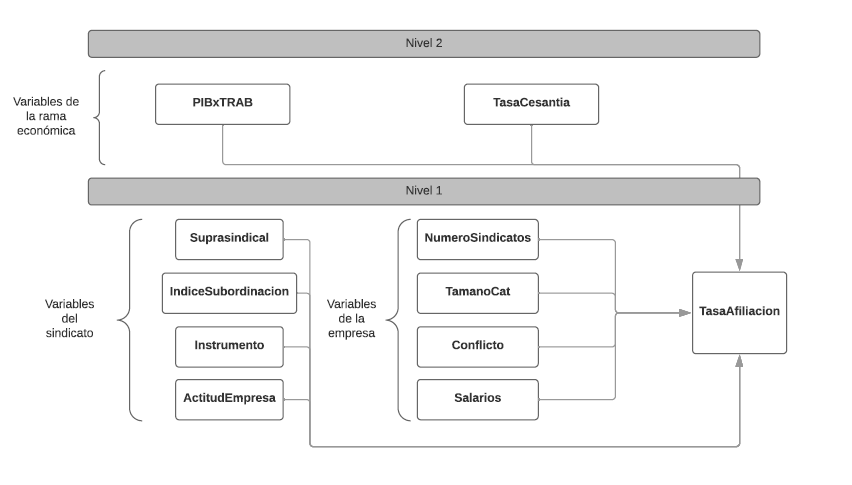

```{r setup, include=FALSE}
knitr::opts_chunk$set(echo = TRUE)
```

# RESUMEN

La presente investigación busca estimar el efecto que el poder estructural y social de los trabajadores, en las ramas económicas y en las empresas, generan sobre la tasa de afiliación de los sindicatos de Chile en 2014. Es decir, se busca conocer porque algunos sindicatos son más representativos que otros al interior de las empresas, recurriendo a la segunda ola del enfoque de los recursos de poderes de los trabajadores y a las teorías de la revitalización sindical [@Frege2004; @Ross2007]. Esto, en el contexto chileno, caracterizado por sus bajos niveles de afiliación sindical y de cobertura en la negociación colectiva, de debilidad institucional de los trabajadores y de una acción sindical legalista y centrada en el nivel de empresa. En específico, se busca dar respuesta a preguntas como ¿La tasa de afiliación sindical se ve afectada por las alianzas que construyen los sindicatos con organizaciones supra sindicales?, ¿Influyen el tipo de relación que sostienen con sus empleadores?, ¿Influyen características de la empresa como su tamaño, el número de sindicatos en su interior o la presencia de conflictos colectivos?, ¿Qué tanto difieren estos aspectos entre las distintas ramas de actividad económica? Para esto, se construyeron una serie de modelos multinivel a partir de la Encuesta Laboral Encla 2014, específicamente a partir de la base de datos de cuestionarios aplicados a Dirigentes Sindicales (N = 717). Se concluye que, el poder estructural en el lugar de trabajo que tienen los trabajadores en las ramas económicas afecta positiva y significativamente los niveles de la afiliación sindical en las empresas chilenas (controlando incluso por tamaño de empresa) y que, al nivel de empresa, la afiliación sindical aumenta a mayor subordinación del sindicato a la empresa y a menor número de organizaciones sindicales paralelas.

**Palabras claves**: sindicalismo, poder estructural, empresa, afiliación sindical, Chile. 

[Respositorio github](https://github.com/nicolasrattor/Tasa_sindicalizacion_encla2014/)

```{r echo = FALSE, message=FALSE, warning=FALSE}

#### Cargar paquetes a utilizar ####

if (!require("pacman")) install.packages("pacman") # solo la primera vez

pacman::p_load(lme4,
               lmtest,
               reghelper,
               GGally,
               haven,
               stargazer,
               ggplot2, # gráficos
               gridExtra,
               dplyr, # manipulacion de datos
               texreg) # tablas lme4
```

# Introducción
Uno de los mayores consensos de los estudios del trabajo sobre Chile es que las relaciones laborales en el país se encuentran desequilibradas en perjuicio de los trabajadores y trabajadoras [@Aguilar2017a; @Campusano2017a; @DirecciondelTrabajo2015; @Julian2018; @Ramos2016], especialmente por la estructura político-institucional heredada de dictadura que regula hasta el día de hoy el trabajo y, por los cambios socioeconómicos y de las formas de organizar la producción que ha sufrido el país en los últimos cuarenta años. La debilidad del trabajo frente al capital se expresa en la profunda desigualdad social y económica que atraviesa al país [@PNUD2017] y en la debilidad de los actores colectivos  de defensa de los derechos de los trabajadores y trabajadoras: desde el retorno a la democracia la tasa de afiliación sindical en el país no ha superado el 20% de los asalariados del sector privado, las negociaciones colectivas tienen una cobertura aún más baja y se encuentran ultra reguladas en sus tiempos, formas y alcances de que cuestiones negociar y, el mencionado sindicalismo ha centrado su acción en el nivel de empresa, de manera despolitizada y atomizada [@Alvarez2017; @Calderon2008].

Pese a esta imagen general de debilidad, a lo menos en los últimos diez años diversas investigaciones de caso, o por ramas de actividad económica, han identificado novedosos procesos de organización sindical: masivos, politizados y efectivos en el logro de sus objetivos [@Aravena2009; @Henriquez2017; @Ratto2019b; @Santibanez2017]. Pero también, otros tanto estudios han mostrado la dificultad de la construcción y del sostenimiento de la organización sindical [@Calderon2008; @Urrutia2015], e incluso, han buscado explicar la ausencia de la misma y del conflicto [@Baeza2017]. Ante tal diversidad de experiencias particulares en las diferentes ramas, resulta pertinente recurrir a fuentes estadísticas para tener una idea de la representatividad de cada una de estas experiencias, como también, conocer y medir el efecto de diferentes elementos al nivel de empresa y de la rama económica que podrían estar influyendo en que unos sindicatos tengan más poder que otros al interior de las empresas. Así, el objetivo general de la presente investigación queda definido como estimar el efecto que el poder estructural y social de los trabajadores, en las ramas económicas y en las empresas, generan sobre la tasa de afiliación de los sindicatos de Chile en 2014.

El poder, en el marco del análisis de clase, puede ser teorizado como la capacidad de las personas y las organizaciones de realizar sus intereses de clase [@Wright2018, pp. 225]. Este último autor ha identificado dos grandes tipos de poder de la clase obrera: el “poder asociativo”, que resulta de la formación de organizaciones colectivas de trabajadores, como sindicatos, partidos y consejos de trabajadores; y el “poder estructural”, que resulta de la ubicación de los trabajadores en el sistema económico, tanto en el mercado laboral como en el lugar de trabajo [@Wright2000]. 

El poder asociativo tradicionalmente ha sido medido a través del número de socios sindicales [@Frege2004], siendo considerado por los autores uno de los cuatro elementos principales para identificar procesos de revitalización sindical. Si bien un alto número o porcentaje de socios sindicales no garantiza un alto poder o una representatividad real de los sindicatos al interior de las empresas [@Gutierrez2016], este es un indicador sencillo de construir, ampliamente utilizado por la literatura y, disponible en registros administrativos y en encuestas laborales chilenas [@DirecciondelTrabajo2015, @DirecciondelTrabajo2018; @Salinero2006).

Uno de los más evidentes elementos que gatillan que los sindicatos en términos individuales sean menos representativos al nivel de empresa, y que tengan menos poder, es el paralelismo sindical. Es decir, la posibilidad de que en la empresa exista y negocie más de un sindicato con el empleador y, por ende, que los trabajadores de una empresa se repartan y dividan entre las distintas organizaciones sindicales. Chile es uno de los pocos países de América Latina y el mundo en los que el paralelismo sindical al nivel de empresa es permitido y promovido por la institucionalidad laboral [@FundacionSol2015; @Pinera1992].

*H1 (nivel 1): a mayor número de sindicatos al interior de las empresas chilenas, menor será la afiliación sindical de cada uno de estos sindicatos, controlando por el número de trabajadores en la empresa.* 

El poder estructural de los trabajadores tiene dos dimensiones: el poder en el mercado laboral, que dependerá de los niveles de desempleo, de las calificaciones de los trabajadores y de los ingresos alternativos a los que reciben por su trabajo asalariado; y el poder en el lugar de trabajo, que dependerá de la centralidad económica de las actividades de los trabajadores y trabajadoras para la producción y circulación de mercancías [@Silver2003; @Wright2000]. Para operacionalizar el poder de los trabajadores en los mercados de trabajo se utilizará la variable "Tasa de Cesantía" en las ramas de actividad económica, mientras que para operacionalizar el segundo poder se utilizará la variable "PIB por Trabajador" en cada una de las mismas.

*H2 (nivel 2): mientras mayor sea el peso de cada trabajador en el producto interno bruto de las ramas de actividad económica, mayor será la tasa de afiliación sindical en las empresas de las ramas.*  

*H3 (nivel 2): mientras mayor es la tasa de desempleo en las ramas de actividad económica en las que se desarrollan las empresas, menor será la tasa de afiliación a los sindicatos de aquellas empresas.* 

Si bien @Wright2018 menciona y advierte que el poder estructural puede influir en el poder asociativo, su objetivo es teorizar los efectos del poder asociativo de los trabajadores sobre los “intereses capitalistas” y sobre los “compromisos de clase”. Estos compromisos son establecidos entre la clase obrera y la clase capitalista en contextos institucionales específicos, como las empresas, los mercados o los Estados. Estos mismos compromisos pueden ser pensados como recursos de poder institucionales que encuadran las disputas de clase y que son movilizados por los actores en conflicto con el fin de materializar sus propios intereses [@Dorre2009]. En el presente texto los recursos de poder institucionales a nivel estatal son considerados como un contexto común a todas las organizaciones sindicales de la muestra.

Un cuarto y último gran tipo de poder ha sido identificado por la “segunda ola” de las teorías de los recursos de poder [@Ludwig2018; @Schmalz2017a]: el poder social o cooperativo de los trabajadores que consiguen al movilizar alianzas sociales y políticas. Este último gran poder ha sido caracterizado por algunos enfoques como un punto de convergencia entre las diferentes estrategias sindicales a nivel internacional: ante la erosión de las instituciones de las relaciones industriales bajo el neoliberalismo, los trabajadores se movilizarían mediante movimientos sociales y sindicales amplios, cuyas organizaciones y demandas van más allá de las clásicamente laborales [@Gasparri2018; @Tattersall2013]. De esta forma "movimientista", las organizaciones sindicales conseguirían revitalizarse, sumar nuevos adherentes y recuperar su poder. Ante la falta de preguntas en la encuesta Encla 2014 sobre alianzas sindicales con actores sociales y políticos más allá de lo laboral, como proxy al poder social se ocuparán las variables que preguntan por alianzas sindicales con organizaciones suprasindicales.

*H4 (nivel 1): los sindicatos que participan de federaciones y/o confederaciones (organizaciones suprasindicales) desarrollarán un mayor poder asociativo que aquellos que no participan de estas organizaciones.*

Otra tesis similar y que a veces entronca con la línea del sindicalismo “comunitario” o “social”, es la del sindicalismo politizado, radical, clasista o militante [@Bacon2002; @Ross2007; @Connolly2012]. Estos autores insisten en que una de las claves para la revitalización sindical está en que los sindicatos utilicen estrategias disruptivas y discursos clasistas para conseguir sus objetivos. Si bien la encuesta Encla 2014 no tiene mediciones sobre la conflictividad de los sindicatos en particular, tiene un proxy que mide la conflictividad laboral en cada una de las empresas y la actitud de las empresas frente a los sindicatos. Como un acercamiento, muy imperfecto, a la politización de los sindicatos, se utilizarán las variables de conflictividad laboral en la empresa y actitud de la empresa hacia la acción sindical.

*H5 (nivel 1): los sindicatos de las empresas que hayan tenido conflictos colectivos en los últimos doce meses tendrán una mayor tasa de afiliación que aquellos de empresas que no hayan tenido conflictos colectivos.*

*H6 (nivel 1): Cuando las empresas tienen actitudes que dificultan la acción sindical mayor será la tasa de afiliación sindical (en tanto se supone que esta acción evidenciaría o generaría conflicto en la empresa).*

La contracara de estas alianzas “entre los de abajo”, son las alianzas que eventualmente pueden organizar los sindicatos con “los de arriba”, de las cuales algunos han señalado que también pueden sacar provecho (Palacios-Valladares, 2010). De todas formas, en general la literatura ha señalado que la subordinación de los trabajadores a las acciones e intereses de las empresas debilitaría a los sindicatos en tanto dejarían de representar genuinamente los intereses de los trabajadores.

*H7 (nivel 1): Mientras más actividades son realizadas por los sindicatos bajo la subordinación de las empresas menor será la tasa de afiliación sindical. *

Otro proxy con el que se puede indagar la relación de subordinación del sindicato a la empresa es el tipo de instrumento colectivo que pactan periódicamente empleadores y trabajadores mediante negociaciones colectivas. Los convenios colectivos, en contraste con los contratos colectivos, no implican tiempos de negociación, fueros sindicales ni derecho a huelga para los trabajadores [@DirecciondelTrabajo2015], por lo que tienden a ser utilizados por sindicatos cercanos a la empresa y en general subordinados a esta [@Gamonal2015]. 

*H8 (nivel 1): los sindicatos que firman convenios colectivos en vez de contratos colectivos en sus negociaciones tendrán una menor tasa de afiliación sindical que los que firman los segundos instrumentos.*

# Datos, variables y métodos
Los datos analizados del nivel 1 provienen de la Encuesta Laboral Encla 2014 de la Dirección del Trabajo. Esta encuesta busca conocer y diagnosticar las condiciones de trabajo y empleo, y las relaciones laborales, de las empresas en Chile mediante la aplicación de cuestionarios a gerentes de recursos humanos, trabajadores y sindicatos. La encuesta el año 2014 se aplicó en 3.374 empresas, las que fueron seleccionadas para ser representativas de 14 ramas económicas (según CIIU 2012 , de las quince regiones del país de ese entonces y de cuatro tamaños de empresas con cinco o más trabajadores o trabajadoras). La Encla consta de cuatro tipos de cuestionarios y, por ende, de cuatro bases de datos diferentes, siendo la base de los informantes “Dirigentes Sindicales” la utilizada en la presenta investigación (N = 717). Este cuestionario solo se aplica en empresas con sindicatos, al sindicato más grande o más representativo de la empresa, en caso de que haya más de un sindicato. El detalle de la distribución de las variables del nivel 1 (Encla 2014) y de su procesamiento se presenta a continuación:

```{r echo = FALSE,message=FALSE,warning=FALSE, results=FALSE,fig.show='hide'}

################################################################################################
####                    Carga y procesamiento variables del nivel 1 (ENCLA)                 ####
################################################################################################

## Bases de datos fueron solicitadas por un colega, vía trasparencia, el año 2016. A su solicitud se se le respondió favorablemente con 4 archivos zip (fecha viernes, 24 de junio de 2016 a las 18:05). Cada archivo contiene una de las cuatro bases de la Encla 2014 (Empleadores, Autoaplicado, Dirigentes Sindicales y Trabajadores) y un archivo pdf con el diccionario de variables.

unzip(zipfile = "Input/BBDD/Nivel1/Autoaplicado - pública.zip", exdir = "Input/BBDD/Nivel1")
unzip(zipfile = "Input/BBDD/Nivel1/Dirigentes - pública.zip", exdir = "Input/BBDD/Nivel1")
unzip(zipfile = "Input/BBDD/Nivel1/Empleadores - pública.zip", exdir = "Input/BBDD/Nivel1")
unzip(zipfile = "Input/BBDD/Nivel1/Trabajadores - pública.zip", exdir = "Input/BBDD/Nivel1")


#### 1. Se carga base Encla 2014 sindicatos y empleadores ####
encla<-read_sav("Input/BBDD/Nivel1/BBDD Dirigentes Sindicales - p£blica.sav")
empleadores<-read_sav("Input/BBDD/Nivel1/BBDD Empleadores - p£blica.sav")


#### 2. Variable dependiente del nivel 1 ####

##Numero de afiliados al sindicato
summary(as.numeric(encla$P1.C))

##Número de trabajadores en la empresa
summary(as.numeric(encla$NUMTRAB))

##Nueva variable porcentaje de sindicalización en la empresa
encla$TasaAfiliacion<-(encla$P1.C/encla$NUMTRAB*100)
summary(encla$TasaAfiliacion)

#La variable tiene 19 NA y hay 18 casos en los que la afiliación es superior al 100% 
table(encla$TasaAfiliacion>100)
table(is.na(encla$TasaAfiliacion>100))

#¿Que hacer con estos casos? Se eliminan
##Hipótesis -> son sindicatos de tipo empresa. En esta encla no hay variable que indique esto
##Por tanto, se eliminan estos casos mayores a 100% y que tienen NA. Quedan 717 casos. 
encla<-encla %>% filter(!is.na(TasaAfiliacion))
encla<-encla %>% filter(TasaAfiliacion<=100)

## Ploteo rápido para ver distirbución de la nueva variable
encla <- encla[order(encla$TasaAfiliacion),] 
plot(encla$TasaAfiliacion)
ggplot(encla, aes(TasaAfiliacion)) + geom_density()

#Cruce entre tasa y afiliación
encla$Afiliados<-encla$P1.C

ggplot(data = encla) +
  geom_point(mapping = aes(x = TasaAfiliacion, y = Afiliados)) + ylim(0,1500) + theme_bw() + theme(legend.position="bottom")

encla$TasaAfiliacion<-as.numeric(as.character(encla$TasaAfiliacion))


#### 3. Variables independientes del Nivel 1 ####

### 3.1 Variables de la organización sindical

## Poder social del sindicato
table(encla$P6.A) #Federación
table(encla$P6.B) #Confederación
table(encla$P7) #Central sindical. No se usará. 

## Se crea variable afiliación suprasindical
encla<-encla %>% mutate(Suprasindical = case_when(P6.A == 1 & P6.B ==1 ~ 1,
                                                  P6.A == 2 & P6.B ==2 ~ 2,
                                                  P6.A == 1 & P6.B ==2 ~ 1,
                                                  P6.A == 2 & P6.B ==1 ~ 1,
                                                        TRUE ~ NA_real_))

encla$Suprasindical<-as.factor(encla$Suprasindical)
#1 es afiliado a federación y/o confederación
encla$Suprasindical<-factor(encla$Suprasindical, labels=c("Afiliado a org. suprasindical",
                                                          "No afiliado a org. suprasindical"))
table(encla$Suprasindical)


## Nivel salarial en la empresa (proxy de poder combinado -> efecto | variable de control)
encla$Salarios<-car::recode(encla$P52,"1=1;2=2;3=3;99=NA;NA=96")
## 96 es que no se han realizado evaluaciones salariales.
encla$Salarios<-factor(encla$Salarios, labels=c("Sobre el promedio", 
                                                 "Bajo el promedio", 
                                                 "Similar al promedio", 
                                                 "El sindicato no ha comparado salarios"))
table(encla$Salarios)


##Tipo de instrumento suscrito por el sindicato (proxy de politización -> el que firma convenio sería proempresa)
table(encla$P77)
encla$Instrumento<-car::recode(encla$P77,"1=1;2=2;3=3;98=NA;NA=4")

#1 Sí, contrato colectivo, 2 Sí, convenio colectivo, 3: No, 4 No aplicable: no ha habido NC o no hay inst.
encla$Instrumento<-factor(encla$Instrumento, labels=c("Sí, contrato colectivo", 
                                                      "Sí, convenio colectivo", 
                                                      "No", 
                                                      "No aplica"))
table(encla$Instrumento)


##ïndice simple de autonomía sindical.
encla$P10.A_rec<-car::recode(encla$P10.A,"0=0;1=1;2=0")
encla$P10.B_rec<-car::recode(encla$P10.B,"0=0;1=1;2=0")
encla$P10.C_rec<-car::recode(encla$P10.C,"0=0;1=1;2=0")
encla$P10.D_rec<-car::recode(encla$P10.D,"0=0;1=1;2=0")
encla$P10.E_rec<-car::recode(encla$P10.E,"0=0;1=1;2=0")
encla$P10.F_rec<-car::recode(encla$P10.F,"0=0;1=1;2=0")
encla$P10.G_rec<-car::recode(encla$P10.G,"0=0;1=1;2=0")
encla$P10.H_rec<-car::recode(encla$P10.H,"0=0;1=1;2=0")
encla$P10.I_rec<-car::recode(encla$P10.I,"0=0;1=1;2=0")
encla$P10.J_rec<-car::recode(encla$P10.J,"0=0;1=1;2=0")
encla$P10.K_rec<-car::recode(encla$P10.K,"0=0;1=1;2=0")

encla$IndiceAutonomia<-(encla$P10.A_rec+encla$P10.B_rec+encla$P10.C_rec+encla$P10.D_rec+
                                encla$P10.E_rec+encla$P10.F_rec+
    encla$P10.G_rec+encla$P10.H_rec+encla$P10.I_rec+encla$P10.J_rec+encla$P10.K_rec)/11

encla$IndiceAutonomia<-as.numeric(encla$IndiceAutonomia)
summary(encla$IndiceAutonomia)

##Ploteo rápido del índice
encla <- encla[order(encla$IndiceAutonomia),] 
plot(encla$IndiceAutonomia)

ggplot(data = encla) +
  geom_point(mapping = aes(x = TasaAfiliacion, y = IndiceAutonomia)) + theme_bw() + theme(legend.position="bottom")


##IndiceSubordinacion
encla$P10.A_rec<-car::recode(encla$P10.A,"0=0;1=0;2=1")
encla$P10.B_rec<-car::recode(encla$P10.B,"0=0;1=0;2=1")
encla$P10.C_rec<-car::recode(encla$P10.C,"0=0;1=0;2=1")
encla$P10.D_rec<-car::recode(encla$P10.D,"0=0;1=0;2=1")
encla$P10.E_rec<-car::recode(encla$P10.E,"0=0;1=0;2=1")
encla$P10.F_rec<-car::recode(encla$P10.F,"0=0;1=0;2=1")
encla$P10.G_rec<-car::recode(encla$P10.G,"0=0;1=0;2=1")
encla$P10.H_rec<-car::recode(encla$P10.H,"0=0;1=0;2=1")
encla$P10.I_rec<-car::recode(encla$P10.I,"0=0;1=0;2=1")
encla$P10.J_rec<-car::recode(encla$P10.J,"0=0;1=0;2=1")
encla$P10.K_rec<-car::recode(encla$P10.K,"0=0;1=0;2=1")

encla$IndiceSubordinacion<-(encla$P10.A_rec+encla$P10.B_rec+encla$P10.C_rec+encla$P10.D_rec+
                              encla$P10.E_rec+encla$P10.F_rec+
                              encla$P10.G_rec+encla$P10.H_rec+encla$P10.I_rec+encla$P10.J_rec+encla$P10.K_rec)/11

encla$IndiceSubordinacion<-as.numeric(encla$IndiceSubordinacion)
summary(encla$IndiceSubordinacion)

encla <- encla[order(encla$IndiceSubordinacion),] 
plot(encla$IndiceSubordinacion)

ggplot(data = encla) +
  geom_point(mapping = aes(x = TasaAfiliacion, y = IndiceSubordinacion)) + theme_bw() + theme(legend.position="bottom")


### 3.2 Variables de la empresa en la que está la organización sindical

#Conflictividad en la empresa -> poco conflicto (ojo con esta variable, no es que el sindicato haya hecho la acción conflictiva. Por ende no mide la politizacion del sindicato
table(encla$P66)
encla <- encla[order(encla$P66),] 
plot(encla$P66)
encla$Conflicto<-factor(encla$P66, labels=c("Ha habido conflictos colectivos en la empresa",
                                            "No ha habido conflictos colectivos en la empresa"))

ggplot(data = encla) +
  geom_point(mapping = aes(x = TasaAfiliacion, y = Afiliados, color=Conflicto)) + ylim(0,1500) + theme_bw() + theme(legend.position="bottom")

#Diálogo social en la empresa -> bastante diálogo social
#No se usará la variable, muy poca varianza. 
table(encla$P72)

#Tamano de la empresa (variable control)
table(encla$TAMAÑO)
encla$TamanoCat<-as.factor(encla$TAMAÑO)
encla$TamanoCat<-car::recode(encla$TamanoCat,"1=2;2=2;3=3;4=4")
table(encla$TamanoCat)
encla$TamanoCat<-factor(encla$TamanoCat, labels=c("Micro y pequeña empresa",
                                            "Mediana Empresa",
                                            "Gran Empresa"))

ggplot(data = encla) +
  geom_point(mapping = aes(x = TasaAfiliacion, y = Afiliados, color=TamanoCat)) + ylim(0,1500) + theme_bw() + theme(legend.position="bottom")


#Otra forma de medir Tamano (NUMTRAB)
summary(encla$NUMTRAB)
encla <- encla[order(encla$NUMTRAB),] 
plot(encla$NUMTRAB)
encla$TamanoNum<-encla$NUMTRAB
plot(encla$TamanoNum)

ggplot(data = encla) +
  geom_point(mapping = aes(x = TasaAfiliacion, y = TamanoNum, color=TamanoCat)) + ylim(0,10000) + theme_bw() + theme(legend.position="bottom")


#Actitud empresa hacia sindicato
table(encla$P12,useNA="ifany")
encla$ActitudEmpresa<-factor(encla$P12,labels=c("Da facilidades para el funcionamiento del Sindicato",
                                                "Ni facilita ni dificulta la acción sindical",
                                                "Pone dificultades"))
ggplot(data = encla) +
  geom_point(mapping = aes(x = TasaAfiliacion, y = TamanoNum, color=ActitudEmpresa)) + ylim(0,10000) + theme_bw() + theme(legend.position="bottom")

ggplot(encla, aes(x = TasaAfiliacion, color = ActitudEmpresa)) + geom_density() + theme_bw() + theme(legend.position="bottom")

ggplot(data=subset(encla,!is.na(ActitudEmpresa)), 
       aes(x = TasaAfiliacion, color = ActitudEmpresa)) + geom_density() + theme_bw() + theme(legend.position="bottom")


#Paralelismo sindical (desde base empleadores)
empleadores$FOLIO<-as.numeric(empleadores$Folio)
emplea<-select(empleadores,FOLIO,P27.NUM)

# se combina sindicatos cn empleadores
encla<-merge(encla,emplea,by="FOLIO")
remove(emplea)

table(encla$P27.NUM)
encla$NumeroSindicatos<-as.numeric(encla$P27.NUM)

encla <- encla[order(encla$NumeroSindicatos),] 
plot(encla$NumeroSindicatos)

ggplot(data = encla) +
  geom_point(mapping = aes(x = TasaAfiliacion, y = NumeroSindicatos)) + theme_bw() + theme(legend.position="bottom")


```

Los 717 casos de la base de datos fueron anidados en 12 ramas de actividad económica: "A - Agricultura","B - Pesca","C - Explotación de minas y canteras","D - Industria manufacturera","E - Suministro de electricidad, gas y agua","F - Construcción","G - Comercio al por mayor y al por menor","H - Hoteles y restaurantes","I - Transporte, almacenamiento y comunicaciones","J - Intermediación financiera","K - Actividades inmobiliarias","M - Enseñanza","N - Servicios sociales y de salud" y "O - Otras actividades".

```{r echo = FALSE,message=FALSE,warning=FALSE,fig.show='hide'}
encla$Actividad<-factor(encla$ACTIVIDAD, labels = c("A - Agricultura...",
                                                          "B - Pesca",
                                                          "C - Explotación de minas...",
                                                          "D - Industria manufacturera",
                                                          "E - Suministro de electricidad...",
                                                          "F - Construcción",
                                                          "G - Comercio...",
                                                          "H - Hoteles y restaurantes",
                                                          "I - Transporte... y comunicaciones",
                                                          "J - Intermediación financiera",
                                                          "K - Actividades inmobiliarias...",
                                                          "M - Enseñanza",
                                                          "N - Servicios sociales y de salud",
                                                          "O - Otras actividades..."
                                                    ))


ggplot(encla, aes(TasaAfiliacion)) + geom_density(aes(fill=factor(Actividad)), alpha=0.8) + 
  labs(title="Tasa de afiliación sindical según actividad económica", 
       caption="Fuente: Encla 2014",
       x="Tasa de afiliación",
       fill="Actividad económica") + theme_bw() + theme(legend.position="bottom")

```

Para estas 12 ramas de actividad se obtuvo información sobre su Producto Interno Bruto (PIB), sobre su cesantía y sobre sus ocupados desde las [Cuentas Nacionales del Banco Central](https://si3.bcentral.cl/estadisticas/Principal1/Excel/CCNN/trimestrales/excel.html) y la [Encuesta Nacional de Empleo](https://www.ine.cl/estadisticas/sociales/mercado-laboral/ocupacion-y-desocupacion) del Instituto Nacional de Estadística. Con estas variables se construyeron las dos variables de nivel 2 que son utilizadas en los modelos del presente texto: “PIBxTRAB” y “TasaCesantía”. 

```{r echo = FALSE,message=FALSE,warning=FALSE, results=FALSE,fig.show='hide'}

################################################################################################
####                      Carga y procesamiento variables del nivel 2                      ####
################################################################################################

Actividad<-c("A - Agricultura...",
             "B - Pesca",
             "C - Explotación de minas...",
             "D - Industria manufacturera",
             "E - Suministro de electricidad...",
             "F - Construcción",
             "G - Comercio...",
             "H - Hoteles y restaurantes",
             "I - Transporte... y comunicaciones",
             "J - Intermediación financiera",
             "K - Actividades inmobiliarias...",
             "M - Enseñanza",
             "N - Servicios sociales y de salud",
             "O - Otras actividades...")


#Tasa de sindicalización de la rama (externa desde datos administrativos)
##Utilizando datos administrativos de la Direccion del Trabajo Año 2014 OND (http://redatam.dirtrab.cl/binchl/RpWebEngine.exe/Portal)
OrganizacionesActivas<-c(435,880,308,1526,146,430,1890,259,1973,193,765,849,242,773)
AfiliadosRama<-c(27887,36210,54320,122676,12623,55820,214542,32588,144830,37840,54115,60256,41086,64425)

##Agregando datos de participacion laboral en el sector vía ENE 2014 OND
Ocupados<-c(732335,51909,241581,882602,67586,661654,1588825,286779,
            583412,173620,496085,664353,384707,250523)

TasaAfiliacionRama<-(AfiliadosRama/Ocupados)

#Poder de mercado (desempleo)
Cesantes<-c(31244	,1416	,21327,	44771	,2421	,64317	,87422	,32607	,30723,	
            9893	,40900	,21007,	13229	,13791)
TasaCesantia<-(Cesantes/Ocupados)

##Nivel salarial de la actividad económica
#Agregando datos salariales ESI del 2014 (https://www.ine.cl/estadisticas/ingresos-y-gastos/esi)
MediaIngresos<-c(284128, 366358 ,829032 ,422367 ,604076 ,485321 ,363433 ,349436 ,477339 ,
                 972242 ,712295 ,530690 ,675135 ,372075)

MedianaIngresos<-c(224958,260000,660000,303127,400000,343544,257658,254952,350000,645000,
                   419921,404169,404169,279947)


#Poder estructural
#Aporte al PIB de la rama económica / número de trabajadores
#Banco central (https://si3.bcentral.cl/estadisticas/Principal1/Excel/CCNN/trimestrales/excel.html)
#Dato en miles de millones de pesos
PIB<-c(4543,
       1003,
       16212,
       16820,
       3673,
       9413,
       13777,
       2832,
       11398,
       6961,
       26251,
       NA,
       NA,
       16194)

#Se multiplica por miles de millones de pesos
PIBxTRAB<-PIB/Ocupados
#Ahora dato esta en miles de millones de pesos por trabajador
table(PIBxTRAB)

#Se multiplica por miles de millones de pesos
PIBxAfil<-PIB/AfiliadosRama


ActividadesEconomicas<-as.data.frame(cbind(Actividad,AfiliadosRama,OrganizacionesActivas,Ocupados,
                                           TasaAfiliacionRama,
                                           MediaIngresos,MedianaIngresos,Cesantes,TasaCesantia,PIB,
                                           PIBxTRAB,PIBxAfil))

#PIB del banco central no tiene dato para Enseñanza y servicios sociales de salud (NA):
ActividadesEconomicas[12,]
ActividadesEconomicas[13,]
#Esto es porque estas dos categorías las contiene Servicios personales: 
ActividadesEconomicas[14,]
#Por esto, se creará una nueva actividad económica que sume Enseñaza, salud y serv personales
ESSP <- c("Z Servicios personales, salud y enseñanza",(60256+41086+64425),(849+242+773),(664353+384707+250523),
          ((60256+41086+64425)/(664353+384707+250523)),NA,NA,(21007+13229+13791),
          ((21007+13229+13791)/(664353+384707+250523)),16194,(16194/(664353+384707+250523)),
          (16194/(60256+41086+64425)))

a<-as.data.frame(ESSP)
a<-data.frame(t(a))
names(a)<-names(ActividadesEconomicas)
basenivel2<-rbind(ActividadesEconomicas,a)
basenivel2<-basenivel2[-c(12:14),] 
remove(a)

basenivel2$AfiliadosRama<-as.numeric(as.character(basenivel2$AfiliadosRama))
basenivel2$OrganizacionesActivas<-as.numeric(as.character(basenivel2$OrganizacionesActivas))
basenivel2$Ocupados<-as.numeric(as.character(basenivel2$Ocupados))
basenivel2$TasaAfiliacionRama<-as.numeric(as.character(basenivel2$TasaAfiliacionRama))
basenivel2$MediaIngresos<-as.numeric(as.character(basenivel2$MediaIngresos))
basenivel2$MedianaIngresos<-as.numeric(as.character(basenivel2$MedianaIngresos))
basenivel2$Cesantes<-as.numeric(as.character(basenivel2$Cesantes))
basenivel2$TasaCesantia<-as.numeric(as.character(basenivel2$TasaCesantia))
basenivel2$PIB<-as.numeric(as.character(basenivel2$PIB))
basenivel2$PIBxTRAB<-as.numeric(as.character(basenivel2$PIBxTRAB))
basenivel2$PIBxAfil<-as.numeric(as.character(basenivel2$PIBxAfil))


```


```{r echo = FALSE,message=FALSE,warning=FALSE, results=FALSE,fig.show='hide'}
################################################################################################
####                          Combinación base de nivel y nivel 2                        ####
################################################################################################

## Nueva variable en la base encla que solo tenga 12 actividades económicas (mismas que banco central)

encla$Actividad<-as.numeric(encla$Actividad)
encla$Actividad_rec<-car::recode(encla$Actividad,"1=1;2=2;3=3;4=4;5=5;6=6;7=7;8=8;9=9;10=10;11=11;12=15;
                                    13=15;14=15")


## Match entre base nivel 2 y base nivel 1
basenivel2$Actividad_rec<-as.numeric(basenivel2$Actividad)

encla<-merge(encla,basenivel2,by="Actividad_rec")


#### Se cambia unidades de medidas de variables para que sean interpretados más facil los modelos ####
#Se cambia la unidad de medida a millones de pesos por trabajadores (antes era miles de millones)
encla$PIBxTRAB<-encla$PIBxTRAB*1000
encla$IndiceSubordinacion<-encla$IndiceSubordinacion*10
encla$Actividad_rec<-factor(encla$Actividad_rec,labels = c("A Agricultura, ganadería, caza y silvicultura",
                                                           "B Pesca",
                                                           "C Explotación de minas y canteras",
                                                           "D Industria manufacturera",
                                                           "E Suministro de electricidad, gas y agua",
                                                           "F Construcción",
                                                           "G Comercio al por mayor y al por menor",
                                                           "H Hoteles y restaurantes",
                                                           "I Transporte, almacenamiento y comunicaciones",
                                                           "J Intermediación financiera",
                                                           "K Actividades inmobiliarias, empresariales y de alquiler",
                                                           "Z Servicios personales, sociales, de salud y enseñanza"))


```

De esta forma, las variables a utilizar en los modelos son los siguientes:

**Tabla 1. Descripción de variables utilizadas en modelos**
```{r  echo = FALSE, message=FALSE, warning=FALSE,fig.show='hide'}

descripcion<-c(
"Tasa de Afiliación Sindical",
"Aporte al PIB de cada trabajador en cada rama de actividad económica (nivel 2)",
"Tasa de cesantía en cada rama de actividad económica (nivel 2)",
"Afiliación del sindicato a organización suprasindical",
"Nivel de los salarios en la empresa en comparación con empresas de la misma rama",
"Instrumento colectivo firmado por sindicato en su última negociación",
"Existencia de conflictos colectivos en la empresa en los últimos doce meses",
"Tamaño de la empresa según número de trabajadores",
"Número de sindicatos en la empresa",
"Índice de subordinación del sindicato a la empresa en actividades",
"Actitud de la empresa hacia acción sindical"
)


nombre<-c(
"TasaAfiliacion (porcentaje del 0% al 100%)",
"PIBxTRAB (en millones de pesos chilenos)",
"TasaCesantia (cesantes divididos por los ocupados de la rama)",
"Suprasindical (Afiliado a organización suprasindical=1 y No Afiliado a organización suprasindical=2)",
"Salarios (Sobre el promedio=1, Bajo el promedio =2, Similar al promedio=3 y El sindicato no ha comparado salarios=4)",
"Instrumento (Sí, contrato colectivo=1, Sí, convenio colectivo=2, No=3 y No aplica=4)",
"Conflicto (Ha habido conflictos colectivos en la empresa=1 y No ha habido conflictos colectivos en la empresa=2)",
"Tamano (Micro y pequeña empresa=1, Mediana Empresa=2 y Gran Empresa=3)",
"NumeroSindicatos (Número del 1 al 100)",
"IndiceSubordinacion (Índice del 1 al 10, donde 1 es baja subordinación y 10 alta subordinación )",
"ActitudEmpresa (Facilita=1, No Facilita ni Dificulta=2, Pone dificultades=3)"
)

descripcion %>% cbind(nombre) %>% as.data.frame() %>% rename("Descripción variable"=1,"Nombre y categorías o unidad"=2) %>% kableExtra::kable() %>% 
  kableExtra::kable_styling(bootstrap_options = c("striped", "hover", "condensed", "responsive"))

```

## Descripción de los modelos a estimar

Se estimaron siete modelos utilizando las variables descritas en el Cuadro 1 y presentadas en la estructura lógica graficada en la Figura 1 (dos niveles, diez variables independientes y una dependiente). En específico: 1) modelo nulo, 2) modelo con variables del nivel uno, 3) modelo con variables del nivel dos, 4) modelo con todas las variables del nivel uno y dos, 5) modelo con las variables significativas del nivel uno y dos, 6) modelo idéntico al anterior pero con intercepto y pendiente aleatoria, y 7) modelo idéntico al anterior pero con interacción entre variables de nivel dos y nivel 1 (“PIBxTRAB” y “NumeroSindicatos”).

**Figura 1. Variables utilizadas para la estimación de los modelos multinivel**



#	Resultados

## Estadísticos descriptivos univariados y bivariados

Los casos válidos utilizados en los modelos varían entre 658 y 717 empresas, dependiendo de las variables utilizadas. En promedio, la tasa de afiliación sindical en las empresas de la muestra es de un 35,6% de los afiliados (linea roja en Gráfico 1), la mediana 32,0% (línea azul en Gráfico 1) y la desviación estándar de 22,9%.

**Gráfico 1. Distribución de la variable Tasa de Afiliación Sindical en la muestra**
```{r echo = FALSE,message=FALSE,warning=FALSE}

ggplot(encla, aes((TasaAfiliacion/100))) +
  geom_histogram() + 
  labs(y="Frecuencia", x = "Tasa de Afiliación sindical") + 
  theme_bw() + 
  geom_vline(xintercept = mean(encla$TasaAfiliacion/100), linetype="dotted", color = "red", size=1.5) +
  geom_vline(xintercept = median(encla$TasaAfiliacion/100), linetype="dotted", color = "blue", size=1.5) +
  scale_x_continuous(labels = scales::percent_format(accuracy = 1))
  
```

En el cuadro 1 se detalla la distribución de las variables:

La variable *Índice de Subordinación* del sindicato a la empresa tiene valores mínimo de 0 puntos (no hay subordinación del sindicato a la empresa) y valores máximos de 10 puntos (en todas las actividades que realiza el sindicato se encuentra subordinado a la empresa). En promedio los sindicatos de la muestra están poco subordinados a la empresa (2,8 puntos en promedio y 2,4 puntos de desviación estándar. 

La variable *Número de Sindicatos* en la empresa tiene un valor mínimo de 1 (un sindicato en la empresa) y valores máximo de 76 (alto pluralismo sindical). En promedio, en las empresas de la muestra existen 2,2 sindicatos, siendo la desviación estándar de 5,1 sindicatos. La mediana de la variable es 1, por lo que la mitad o más de las empresas de la muestra solamente tienen un sindicato.

La variable *PIB por trabajador* en cada una de las ramas de actividad económica tiene valores mínimos de 6,2 millones de pesos por trabajador y valores máximos de 67 millones de pesos por trabajador al año. En promedio, el aporte al PIB por trabajador en todas las empresas de la muestra es de 23,8 millones de pesos y la desviación estándar es de 17,7 millones. La mediana es 19.1 millones de pesos. 

Por último, respecto a las numéricas, la *tasa de cesantía* en las ramas de actividad económica durante el trimestre Octubre-Diciembre del año 2014 tiene valores mínimos de un 2,7% de los trabajadores y valores máximos de un 11,4% de los trabajadores, promediando 5,7% de cesantía y 2,3% de desviación estándar en el total de las empresas de la muestra.

Respecto a las variables categóricas, en el mismo Cuadro 1 se puede observar que el 67,5% de los sindicatos de las empresas de la muestra no se encuentran afiliados a organizaciones suprasindicales (*Suprasindical*) como Federaciones o Confederaciones; el 16% de los dirigentes de los sindicatos evalúa los salarios de su empresa (*Salarios*) como "sobre el promedio", 22,7% bajo el promedio, 28,7% similar al promedio y 30,5% declara no haber realizado el ejercicio de comparar salarios; respecto a la variable *Instrumento*,el 55,1% de los sindicatos en su última negociación firmó contratos colectivos con la empresa, un 19,7% firmó convenios colectivos, un 4,2% no firmó ningún instrumento y un 21,1% no ha negociado colectivamente (no aplica); respecto a *Conflicto*, en un 85,6% de las empresa no ha habido conflictos colectivos en los últimos doce meses; respecto a *TamanoCat*, un 7,1% de las empresas de la muestra son micro o pequeñas empresaa, un 32,2% son medianas empresas y un 60,7% son grandes empresas; respecto a *ActitudEmpresa*, para el 62,8% de los informantes de los sindicatos la empresa da facilidades para el funcionamiento del sindicato y solamente para un 12,3% la empresa pone dificultades. Por último, se debe hacer notar que la mayoría de las empresas (24%) se encuetran en la rama de actividad económica "Servicios Sociales, Educación y Saud", posteriormente sigue Industria Manufacturera con un 14,1%, Actividades inmobiliarias, empresariales o de alquiler con un 11,7% y Transporte, Almacenamiento y comunicaciones con un 10,2%. Las ramas con menor peso en la muestra son Agricultura (3,5%), Pesca (3,8%), Explotación de minas y canteras (3,9%) e Intermediación Financiera (4%).

```{r echo = FALSE,message=FALSE,warning=FALSE}
library(summarytools)
Variables_modelos<-encla %>% select(TasaAfiliacion,IndiceSubordinacion,NumeroSindicatos,PIBxTRAB,TasaCesantia,
                                    Suprasindical,Salarios,Instrumento,Conflicto,TamanoCat,ActitudEmpresa,
                                    Actividad.y) %>% 
  mutate(TasaCesantia=TasaCesantia*100) %>% 
  as.data.frame

print(dfSummary(Variables_modelos, graph.magnif = 0.75), method = 'render')

```

En el Cuadro 3 se presenta la distribución de las variables ya descritas pero para el nivel 2 (ramas de actividad económica). Como se observa, hay importantes diferencias en las tasas de afiliación sindical de cada rama de actividad económica: mientras las más bajas son "Agricultura..." y "Pesca" con un 25% y 23%, respectivamente, las más altas son suministro de "Electricidad, gas y agua", "Explotación de minas y canteras", y "Servicios Personales, Salud y Enseñanza", con un 50%, 43% y 40%, respectivamente. De las ramas con menor afiliación sindical destacan sus bajos niveles de PIB por trabajador (6 y 19 millones de pesos), sus relativos bajos niveles de tasa cesantía (4% y 3%), sus relativos bajos tamaños de empresa (354 y 581 trabajadores en promedio), su bajo paralelismo sindical (1,3 y 1,7 sindicatos en promedio por empresa) e Índices de subordinación a la empresa más o menos altos (2,8 y 3,4 puntos). De las dos ramas con mayor afiliación sindical destacan sus altos niveles de PIB por trabajador (67 y 54 millones de pesos), la tasa de cesantía es tanto baja como alta (3,6% contra 8,8%), los tamaños de la empresa son tanto bajos como altos (270 y 724 trabajadores), el número de sindicato es tanto alto como bajo (2,5 y 1,7 sindicatos) y el Índice de subordinación es alto (4 y 3,1 puntos).

**Tabla 3. Ramas de actividad económica utilizadas en modelo**
```{r, echo = FALSE,message=FALSE,warning=FALSE}

encla %>% select(Actividad.y,
                 TasaAfiliacion,PIBxTRAB,TasaCesantia,TasaAfiliacion,Afiliados,TamanoNum,NumeroSindicatos,
                                  IndiceSubordinacion) %>% as.data.frame %>% 
  group_by(Actividad.y) %>% 
  summarise_all(mean,na.rm=TRUE) %>% 
  kableExtra::kable(col.names=c("Actividad","Tasa de Afiliación","PIB por trabajador","Tasa de Cesantía","Afiliados","Tamaño
                    empresas","Número sindicatos","Índice de Subordinación")) %>% 
  kableExtra::kable_styling(bootstrap_options = c("striped", "hover", "condensed", "responsive"))
```

En el Cuadro 4 se observa cuales de las relaciones entre la variable dependiente Tasa de Afiliación y las mencionadas variables independientes correlacionan significativamente. Como se observa, la variable dependiente correlaciona significativamente con Índice de Subordinación (con un 95% de confianza, de manera positiva), con Tamaño de la empresa según categoría de número de trabajadores (con un 99,9% de confianza, de manera negativa), con Número de Sindicatos (con un 99,9% de confianza, de forma negativa), con Actitud de la empresa (con un 99,9% de confianza, de forma negativa) y con PIB por trabajador (con un 95% de confianza, de forma positiva). Es decir, la tasa de afiliación sindical será más alta en las empresas a mayor subordinación del sindicato a la empresa, a menor tamaño de la empresa, a menor número de sindicatos en la empresa, a mejor actitud de la empresa hacia el sindicato y mientras mayor sea el PIB por trabajar en la rama de actividad económica de la empresa. Las variables Conflicto, Instrumento, Salarios y Tasa de Cesentía no tienen una relación bivariada significativa con la tasa de afiliación sindical, con a lo menos un nivel de 95% de confianza, por lo que es esperable que tampoco sean significativas en los modelos multinivel que se presentan a continuación. 

**Tabla 4. Matriz de correlaciones de variables utilizadas en modelo**
```{r}
library(sjPlot)
base=encla %>% select(TasaAfiliacion,IndiceSubordinacion,Conflicto,Instrumento,
                            TamanoCat,NumeroSindicatos,Salarios,ActitudEmpresa,
                            PIBxTRAB,TasaCesantia) %>% as.data.frame
base[1:10]<-sapply(base[1:10],as.numeric)
sjp.corr(base)
```


## Modelos multinivel estimados

Los resultados indican la pertinencia de la aplicación de un modelo multinivel, pues se ha obtenido una correlación intraclase relativamente importante (ICC = 0,0806), lo que es un indicio de que existiría una dependencia contextual en los datos según rama de actividad económica. Es decir, que la afiliación sindical en las empresas de la muestra se explica en un 8% por variaciones de las ramas de actividad económica. Esto, gráficamente se observa en el Gráfico 2, donde se observan importantes diferencias en las tasas de afiliación sindical entre los sectores, contrastando, por ejemplo, Agricultura, Pesca o Construcción, cuyos sindicatos se concentran en tasas menores al 25%, mientras que Intermediación financiera, Minería o Suministro de Electricidad se concentran en tasas de sindicalización del 50% o más.

**Gráfico 2. Tasa de afiliación sindical según actividad económica**
```{r,echo = FALSE, message=FALSE, warning=FALSE}
# ggplot(encla, aes((TasaAfiliacion/100))) + geom_density(aes(fill=factor(Actividad_rec)), alpha=0.8) + 
#   labs(caption="Fuente: Encla 2014",
#        x="Tasa de afiliación",
#        y="Proporción de empresas",
#        fill="Actividad económica") + theme_bw() + theme(legend.position="bottom",legend.text=element_text(size=7)) +
#   scale_x_continuous(labels = scales::percent_format(accuracy = 1)) + 
#   guides(fill = guide_legend(title.position = "top",ncol = 2))
  
ggplot(encla, aes((TasaAfiliacion/100))) + geom_density(aes(fill=factor(Actividad_rec)), alpha=0.8) + facet_wrap(~factor(Actividad_rec),ncol = 3) + 
  labs(caption="Fuente: Encla 2014",
       x="Tasa de afiliación",
       y="Proporción de empresas en cada sector",
       fill="Actividad económica") + theme_bw() + theme(legend.position = "none",strip.text = element_text(size=7)) +
  scale_x_continuous(labels = scales::percent_format(accuracy = 1))
  
```

Al ocupar factor de expansión las distribuciones cambian de manera importante. Este es un punto pendiente en el presente artículo: ponderar los datos en el modelo. 

**Gráfico 3. Tasa de afiliación sindical según actividad económica (expandido)**
```{r,echo = FALSE, message=FALSE, warning=FALSE}
# ggplot(encla, aes((TasaAfiliacion/100))) + geom_density(aes(fill=factor(Actividad_rec)), alpha=0.8) + 
#   labs(caption="Fuente: Encla 2014",
#        x="Tasa de afiliación",
#        y="Proporción de empresas",
#        fill="Actividad económica") + theme_bw() + theme(legend.position="bottom",legend.text=element_text(size=7)) +
#   scale_x_continuous(labels = scales::percent_format(accuracy = 1)) + 
#   guides(fill = guide_legend(title.position = "top",ncol = 2))

ggplot(encla, aes((TasaAfiliacion/100), weight = FX_EMPRESAS)) + geom_density(aes(fill=factor(Actividad_rec)), alpha=0.8) + facet_wrap(~factor(Actividad_rec),ncol = 3) + 
  labs(caption="Fuente: Encla 2014",
       x="Tasa de afiliación",
       y="Proporción de empresas en cada sector",
       fill="Actividad económica") + theme_bw() + theme(legend.position = "none",strip.text = element_text(size=7)) +
  scale_x_continuous(labels = scales::percent_format(accuracy = 1))
  
```

Se estiman 7 modelos diferentes (ver Tabla 5). En el **Modelo 1** se introducen como variables independientes todas las variables del nivel 1 para explicar el porcentaje de la afiliación sindical en las empresas. Se observa en el modelo que el intercepto es de un 71,6%, significativo con un 99,9% de confianza. Además, la variable Suprasindical no es significativa, de la variable "Salarios" solamente es significativa su categoría neutral "Similar al Promedio" (beta de -6,3%), de la variable "Instrumento" solamente es significativa su categoría "no aplica" (el sindicato no ha negociado, beta de -5,2%), de la variable "Conflicto" es significativa con un 95% de confianza su categoría "No ha habido conflictos colectivos en la empresa" (beta de -5,6%), de la variable Tamaño de la empresa son significativas con un 99,9% de confianza sus categorías "Mediana empresa" (beta de -17,5%) y "Gran empresa" (beta de -30,8%) y de la variable "Actitud de la empresa" son significativas sus dos categorías: "la empresa ni facilita ni dificulta la acción sindical" (95% de confianza y beta de -4,2%) y "la empresa pone dificultades" (99,9% de confianza y beta de -11,2%). La variable numérica "Número de Sindicatos" es significativa con un 99,9% y un beta de -0,61% y el "Índice de Subordinación" es significativo con un 95% de confianza y un beta de 0,8%.

En el **modelo 2** solo se introducen como variables independientes las variables de nivel 2, de las cuáles solo "PIB por trabajador" en la rama de actividad económica es significativa, con un 95% de confianza y un valor beta de 0,22%. Esto quiere decir que por cada millón de pesos que cada trabajador aporta al PIB en cada rama de actividad económica, el porcentaje de afiliación sindical aumenta en un 0,22%. Por ejemplo, si en una rama como Agricultura el PIB por trabajador es de 6,2 millones de pesos por trabajador, y en otra como Explotación de Minas y Canteras es de 67 millones de pesos por trabajador, la tasa de afiliación sindical aumentaría en un 13,3% si un sindicato pasa de la primera a la segunda rama de actividad económica, controlando por la variable "Tasa de Cesantía" del modelo. Además, el intercepto del modelo es significativo con un 99,9% de confianza y un beta de 33,7%. 

En el **modelo 3** se introducen todas las variables independientes del nivel 1 y del nivel 2. En este modelo el intercepto sigue siendo significativo con un 99,9% de confiaza y un beta de 68,3%. La significación y la dirección de los valores beta de las variables de nivel 1 y de nivel 2 son identicas a las de los modelos 2 y 3, solamente cambian los valores beta en algunas unidades porcentuales que no hacen mayores diferencias. 

En el **modelo 4** solamente se mantuvieron aquellas variables que eran significativas en los modelos 2, 3 y 4 y cuyas categorías significativas no eran neutrales o medias. Es decir, se quitaron las variables "Salarios" e "Instrumento", cuyas únicas categorías signifivativas eran "Salarios Similares al Promedio" y "No Aplica (no hubo negociación)", respectivamente. Así también, se quitó la variable "Suprasindical" del nivel 1 y "Tasa de Cesantía" del nivel 2 por no ser significativas. Así, el modelo 5 quedó con un intercepto con un valor beta de 59,6%, significativo con un 99,9% de confianza. En el modelo 5 las variables Conflicto, Índice de Subordinación, Empresa ni facilita ni dificulta la acción sindical y PIB por Trabajador son significativas con un 95% de confianza. Además, las categorías "Tamaño de la Empresa Mediana", "Tamaño de la Empresa Grande", la "Empresa pone dificultades a la acción sindical" y la variable "Número de Sindicatos" son significativas con un 99,9% de confianza. 

**Tabla 5. Modelos multinivel estimados**
```{r, results='asis', echo = FALSE, message=FALSE, warning=FALSE, cache = TRUE}
#### 6.1 Modelo 0 ####
##ICC - Intra class correlation
results_0 = lmer(TasaAfiliacion ~ 1 + (1 | Actividad_rec), data = encla)
#### 6.2 Modelo 1 ####
#Solo variables nivel 1
results_1 = lmer(TasaAfiliacion ~ 1 + Suprasindical + Salarios + Instrumento + Conflicto +TamanoCat + NumeroSindicatos + IndiceSubordinacion + ActitudEmpresa + 
(1 | Actividad_rec), data = encla)

#### 6.3 Modelo 2 ####
#Solo variables nivel 2
results_2 = lmer(TasaAfiliacion ~ 1 + PIBxTRAB + TasaCesantia + (1 | Actividad_rec), data = encla)

#### 6.4 Model 3 ####
#Nivel individual y grupal
results_3 = lmer(TasaAfiliacion ~ 1 + PIBxTRAB + TasaCesantia + NumeroSindicatos +
                   Suprasindical + Salarios + Instrumento + Conflicto + 
                   TamanoCat + IndiceSubordinacion +  ActitudEmpresa +
                   (1 | Actividad_rec), data = encla)
#### 6.4 Model 4 ####
#Nivel individual y grupal -> solo variables significativas
results_4 = lmer(TasaAfiliacion ~ 1 + PIBxTRAB +  ActitudEmpresa + Conflicto + 
                   TamanoCat + IndiceSubordinacion + NumeroSindicatos + 
                   (1 | Actividad_rec), data = encla)

#### 6.5 Model 5: pendiente e interceptos aleatorios ####
results_5 = lmer(TasaAfiliacion ~ 1 + PIBxTRAB + ActitudEmpresa + Conflicto +
                   TamanoCat + IndiceSubordinacion + NumeroSindicatos +
                   (1 + NumeroSindicatos | Actividad_rec), data = encla)

#### 6.6 Model 6: pendiente aleatoria e interaccion ####

results_6 = lmer(TasaAfiliacion ~ 1 + PIBxTRAB + ActitudEmpresa + Conflicto +
                   TamanoCat + IndiceSubordinacion + NumeroSindicatos + PIBxTRAB*NumeroSindicatos + 
                   (1 + NumeroSindicatos | Actividad_rec), data = encla)

#### Comparación modelos ####

stargazer(results_0,results_1,results_2,results_3,results_4,results_5,results_6, type = "html",
          dep.var.labels=c("Tasa de sindicalización"),
          digit.separator=".",
          decimal.mark=",",
          digits=2,
          object.names = TRUE,
          column.labels = c("M0", "M1", "M2", "M3", "M4", "M5", "M6"))

```


El **modelo 5** es prácticamente igual al **modelo 4**, solamente que se aleatorizó la pendiente del modelo a partir de la variable Número de Sindicatos. Con esto, la significación de las variables del modelo y del intercepto se mantuvo en los mismos niveles y sus valores en la misma dirección: las variables Conflicto, Índice de Subordinación, Empresa ni facilita ni dificulta la acción sindical y PIB por Trabajador se mantienen siendo significativas con un 95% de confianza y las categorías "Tamaño de la Empresa Mediana", "Tamaño de la Empresa Grande", la "Empresa pone dificultades a la acción sindical" y la variable "Número de Sindicatos" se mantienen significativas con un 99,9% de confianza. La distinta relación según ramas de actividad económica, entre el número de sindicatos en las empresas y la tasa de afiliación, que sugiere el modelo 6 se puede observar gráficamente a continuación.

## Ajuste modelos

Tratamientos presentados por [Castillo (2019)](https://juancarloscastillo.github.io/jc-castillo/documents/diplomado_multinivel/d_ajuste-reporte.html).

> Cálculo R2 B&R

Extraer componentes de la varianza para cálculo de R2
```{r}
varcomp_0=as.data.frame(VarCorr(results_0))
tau00_0=varcomp_0[1,4]
sigma2_0=varcomp_0[2,4]

varcomp_1=as.data.frame(VarCorr(results_1))
tau00_1=varcomp_1[1,4]
sigma2_1=varcomp_1[2,4]

varcomp_2=as.data.frame(VarCorr(results_2))
tau00_2=varcomp_2[1,4]
sigma2_2=varcomp_2[2,4]

varcomp_3=as.data.frame(VarCorr(results_3))
tau00_3=varcomp_3[1,4]
sigma2_3=varcomp_3[2,4]

varcomp_4=as.data.frame(VarCorr(results_4))
tau00_4=varcomp_4[1,4]
sigma2_4=varcomp_4[2,4]

varcomp_5=as.data.frame(VarCorr(results_5))
tau00_5=varcomp_5[1,4]
sigma2_5=varcomp_5[2,4]

varcomp_6=as.data.frame(VarCorr(results_6))
tau00_6=varcomp_6[1,4]
sigma2_6=varcomp_6[2,4]
```

Cálculo

```{r}
# Modelo 1 (predictores individuales)

R2_1_L1=(sigma2_0-sigma2_1)/sigma2_0
R2_1_L1

# Modelo 2 (predictores grupales)
R2_2_L2=(sigma2_0-sigma2_2)/sigma2_0
R2_2_L2
R2_2_L2=(tau00_0-tau00_2)/tau00_0
R2_2_L2

# Modelo 3 (predictores grupales e individuales)
R2_3_L1=(sigma2_0-sigma2_3)/sigma2_0
R2_3_L1
R2_3_L2=(tau00_0-tau00_3)/tau00_0
R2_3_L2

# Modelo 4 (predictores grupales e individuales)
R2_4_L1=(sigma2_0-sigma2_4)/sigma2_0
R2_4_L1
R2_4_L2=(tau00_0-tau00_4)/tau00_0
R2_4_L2


# Modelo 5 (predictores grupales e individuales)
R2_5_L1=(sigma2_0-sigma2_5)/sigma2_0
R2_5_L1
R2_5_L2=(tau00_0-tau00_5)/tau00_0
R2_5_L2


# Modelo 6 (predictores grupales e individuales)
R2_6_L1=(sigma2_0-sigma2_6)/sigma2_0
R2_6_L1
R2_6_L2=(tau00_0-tau00_6)/tau00_0
R2_6_L2


# ICC (para comparación)
ICC_0=tau00_0/(tau00_0+sigma2_0)
ICC_0
```

En el modelo 5, para el caso del R2 nivel 2, se está dando cuenta del 44,3% de su varianza intra clase (8,0%). 

> Test de devianza (deviance)

Pendiente...

```{r}
anova(results_0,results_2)

anova(results_1,results_3)

anova(results_4,results_5)

anova(results_5,results_6)

```


Pendiente reeescribir:

La gran diferencia entre el **modelo 4** y el **modelo 5** tiene que ver con sus ajustes. El R cuadrado ajustado del modelo 5 para el nivel 2 es de 0.49, mientras que el del modelo 6 es 0,44. Es decir, que el modelo 6 explica un 5% menos (49%-40%) de la varianza intraclase de la afiliación sindical (ICC = 0,0806). Pero por otro lado, el modelo 6 tiene un mejor ajuste que el modelo 5: el primero tiene un R cuadrado ajustado de 0,19 contra un 0,18 del segundo. Es decir, una mayor proporción de la varianza de la afiliación sindical es explicada por el modelo 6 que por el modelo 5. Por último, al hacer un test de devianza, comparando el ajuste los dos modelos según el de log verosimilitud de cada uno, se logra un resultado de 26.66, valor que se encuentra por sobre el valor crítico de 9.2 (DF=2, 99% de confianza). Es decir, se rechaza la hipótesis nula de que los dos modelos no tienen diferencias. En otras palabras, el modelo 5 presenta un mejor ajuste que el modelo 4. De las tres pruebas de ajustes realizadas, en dos de estas el modelo 5 es un mejor modelo que el 4, por lo que se nos quedaremos con este modelo. 

El **modelo 6** es idéntico al **modelo 5**, salvo que en este se hace interactuar el nivel 1 con el nivel 2, específicamente mediante las variables Número de Sindicatos y PIB por Trabajador, respectivamente. Como se observa en el Cuadro 5 la interaccón entre ambas variables no es significativa con a lo menos un 95% de confianza, por lo que el modelo no se analizará. Además, su R cuadrado ajustado es de 0.19 (igual al modelo 4), su R cuadro ajustado que explica la variación intraclase es de 0.29 (menor al modelo 5 y 6) y el test de devianza en comparación con el modelo 6 no es significativo ni con un 95% de confianza.  


#	Resumen y conclusiones 

Como se ha ido argumentando, el mejor de los modelos del Cuadro 5 parece ser el modelo 6. Según este modelo, en las empresas en las que no ha habido conflicto en los últimos doce meses, los sindicatos tienen una afiliación sindical de un 5,28% menos que en las que si ha habido conflictos. Es decir, que en las empresas existan conflictos colectivos se asocia positivamente a la revitalización sindical o al aumento de su poder asociativo (mayor tasa de afiliación sindical), cuestión que serviría como argumento para aquellas teorías que identifican en las estrategias sindicales movimientistas y radicales la clave para el fortalecimiento de las organizaciones sindicales [@Connolly2012). Pero habría que advertir que este conflicto no es necesariamente protagonizado por el sindicato cuyo dirigente fue encuestado en la muestra, sino que podría haber sido otro de la empresa. En estos casos, el pluralismo sindical podría incentivar la competencia entre sindicatos y el fortalecimiento de estos en este proceso de competencia, en la cual el conflicto colectivo, o las huelgas [@Akkerman2008], pueden ser una estrategia por parte de estos mismos sindicatos para atraer a nuevos socios.

Pero el conflicto en sí mismo no siempre parece beneficiar a los sindicatos: cuando este es protagonizado por la empresa y reacae en el sindicato el rol de actor antagónico, el poder sindical se ve fuertemente reducido. Los sindicatos de las empresas en las que, según los dirigentes, estas ponen dificultades para la acción sindical, la tasa de afiliación es de un 12% menos que en aquellas empresas en las que se dan facilidades para la acción sindical. Si bien solamente en un 10% de las empresas de la muestra se les ponen dificultades a los sindicatos para funcionar, el que se ejerzan estas dificultades compromete significativamente la acción sindical.

El sindicato que quiera ser altamente representativo al interior de la empresa, además de evitar ser objeto del antagonismo de la empresa, puede buscar subordinarse a la misma. Es decir, no hacer sus acciones de forma autónoma, sino que en cooperación con la empresa. Según el modelo 6, a medida que aumenta en un punto la subordinación del sindicato a la empresa (escala del 1 al 10) su tasa de afiliación sindical aumenta en un 0.82%. Es decir, mientras más actividades realizan los sindicatos en conjunto con la empresa mayor es la tasa de afiliación sindical: un sindicato que realiza todas sus actividades con la empresa tendrá una afiliación sindical de un 8.2% más que la de aquellos sindicatos que realizan todas sus actividades sin la empresa. Las preguntas que quedan abiertas sobre este punto son si estos sindicatos efectivamente velan por el interés de sus socios y si este tipo de sindicatos pueden seguir llamándose "sindicatos", o es mejor llamarlos simplemente secciones del departamento de Recursos Humanos de la empresa.

Además, se confirma la hipótesis de que mientras más sindicatos existan en la empresa menor será la tasa de afiliación sindical del sindicato mayoritario, cuyo dirigente fue encuestado: por cada sindicato existente en la empresa la afiliación sindical baja en un 1% según el modelo 6. Recordar que sí bien existen empresas en las que hay más de 20 sindicatos -incluso 67-, en promedio por empresa hay 2.2 sindicatos y en tres cuartos de las empresas hay dos sindicatos o menos (ver Cuadro 2, columna Pctl(75)). Es decir, que si bien las diferencias en la tasa de afiliación son gigantescas entre una empresa con 1 sindicato y otra empresa con varias decenas de sindicatos (Gráfico 3), lo común es que estas diferencias sean mínimas, en tanto la mayor variabilidad en la muestra se da entre empresa con uno o dos sindicatos. 

El tamaño de las empresas influye en la representatividad que consiguen cada uno de sus sindicatos al interior: mientras más grandes son las empresas menor será la tasa de afiliación del sindicato mayoritario en la empresa. En las empresas medianas, en comparación con las micro y pequeñas (MYPES), la afiliación sindical es de un 16,4% menos y, en las grandes empresas, la cifra es de un 29.4% menos. Esto puede deberse tanto a la creciente complejidad de las empresas más grandes en comparación con las más pequeñas, que para los sindicatos se torna más dificil representar y organizar (diferentes perfiles ocupacionales, diferentes locales de trabajo, etc.), o también, al pluralismo sindical: mientras más grande sea la empresa más probable es que existan más sindicatos en su interior.

Por último, mencionar que el poder estructural en el lugar de trabajo que tienen los trabajadores en cada rama de actividad económica (medido como PIB por Trabajador) ejerce un efecto significativo y positivo sobre la tasa de afiliación sindical: mientras más poder estructural tienen los trabajadores en las ramas económicas mayor será el poder asociativo de los sindicatos en las empresas. El poder estructural no solo se asocia a una mayor ocurrencia de huelgas laborales [@Silver2003], sino también a una mayor representatividad sindical. En específico, el modelo 6 permite concluir que por cada millón de pesos que aporta un trabajador al PIB de las ramas de actividad económica de la empresa, la tasa de afiliación sindical del sindicato en la empresa aumenta en un 0.20%. Por ejemplo, en la rama Comercio sus trabajadores tienen "poder estructural" de 8.6 millones por trabajador, mientras que en la rama Explotación de Minas y Canteras los trabajadores tienen un poder de 67.1 millones de pesos por trabajador. La diferencia de 58.4 millones de pesos por trabajador entre las dos ramas se expresaría en que, con una significación del 95%, la rama Explotación de minas tiene una tasa de afiliación sindical de un 11.7% más que la rama Comercio, controlando por las restantes variables del modelo 6.

# Bibliografía


